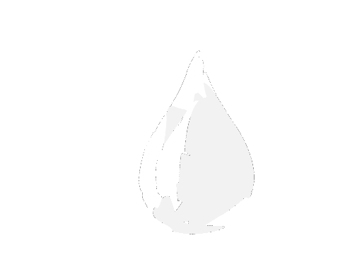
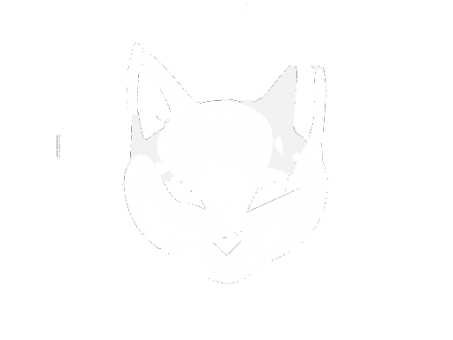
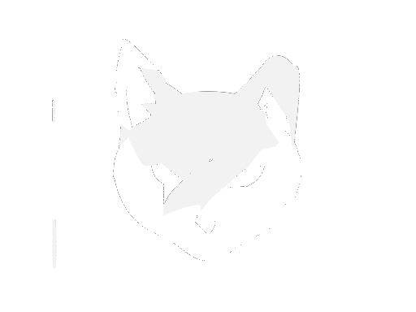
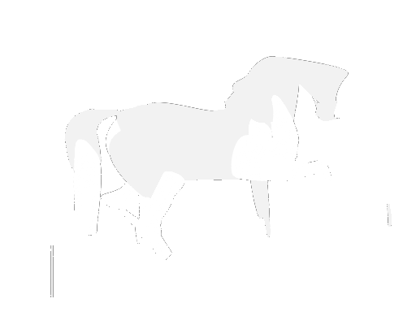
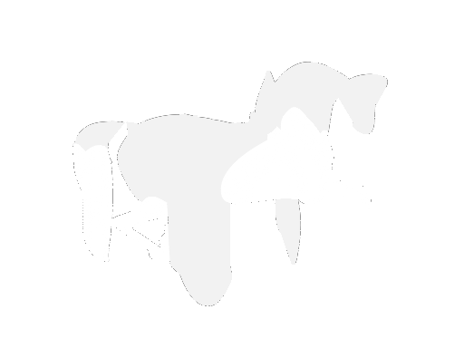
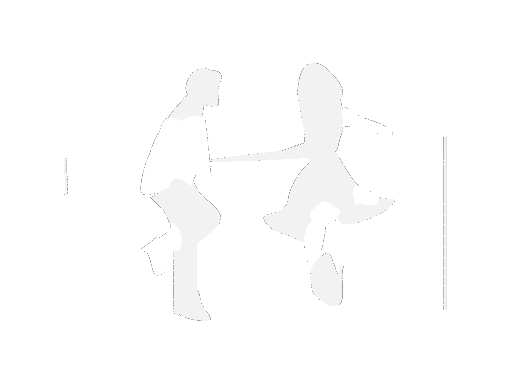
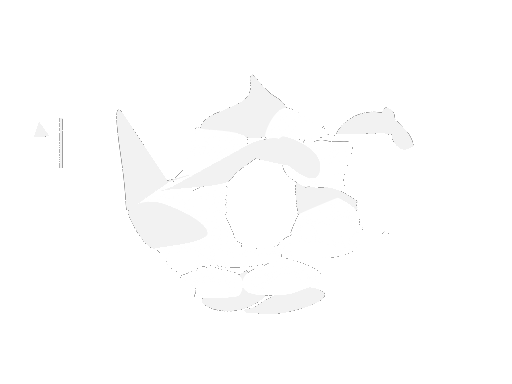
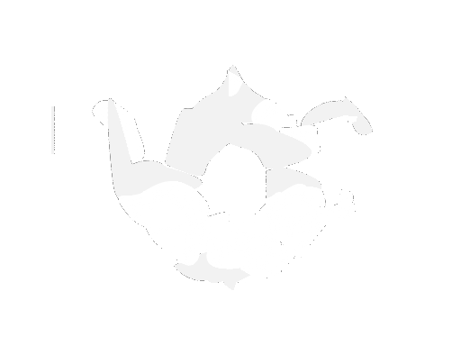
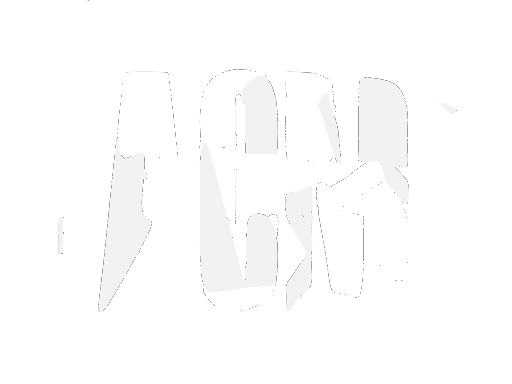
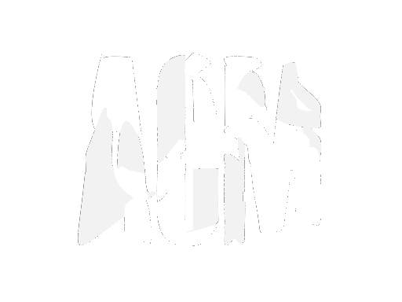

# Snapshot — negspace nonorm4 vs. original weights

Taken **2026-07-25 02:52 EDT**, mid-flight. Nothing here is final except
`water_fire` on the negspace side.

Two batches were running when this was cut, 13 jobs total:

| batch | checkout | branch | sweep | jobs | state |
|---|---|---|---|---|---|
| negspace `nonorm4`, arm `srd_restart` | `aps-hinge2` | `main` | `results/negspace/neg_minarea_nonorm4_20260724` | 7 | 1 converged, 6 running (~4h50m) |
| original weights | `aps-original` | `original-baseline` | `results/original/orig_20260724` | 7 | 7 running (~2h–3h50m) |

`nonorm4` = non-area-normalized view loss, silhouette 0.9 / negative space 3.6.
Original = SceneOptimizer class defaults, silhouette 2.0 / negative space 2.5,
also non-normalized. Both uniform deletion, constrained theta, planar overlap.

## Numbers at snapshot time

Last logged step for every job. **Steps are not matched between batches** — the
negspace jobs started ~1h50m earlier and are 300–800 steps ahead — so read the
columns, not the rows, until both converge.

### negspace nonorm4 / srd_restart

| pair | step | loss | mean IoU | spill | patches | overlap |
|---|---|---|---|---|---|---|
| cat_face_bass | 2100 | 0.0348 | 0.944 | 0.0101 | 29 | 9.5e-5 |
| water_fire | 1500 **converged** | 0.0205 | 0.936 | 0.0060 | 22 | 4.5e-5 |
| sun_moon | 1800 | 0.0376 | 0.921 | 0.0084 | 29 | 1.8e-4 |
| horse_circle | 1500 | 0.0652 | 0.904 | 0.0115 | 32 | 2.4e-5 |
| dance_argument | 1700 | 0.0742 | 0.843 | 0.0203 | 30 | 1.9e-5 |
| teapot_droplets | 1600 | 0.0622 | 0.824 | 0.0456 | 34 | 2.2e-5 |
| acm_scf | 1800 | 0.1187 | 0.806 | 0.0344 | 32 | 6.7e-5 |

### original weights

| pair | step | loss | mean IoU | spill | patches | overlap |
|---|---|---|---|---|---|---|
| water_fire | 1700 | 0.0180 | 0.972 | 0.0065 | 24 | 4.2e-6 |
| sun_moon | 1500 | 0.0586 | 0.951 | 0.0233 | 30 | 1.9e-4 |
| cat_face_bass | 1800 | 0.0722 | 0.945 | 0.0261 | 25 | 6.1e-4 |
| horse_circle | 800 | 0.2001 | 0.889 | 0.0664 | 31 | 9.5e-6 |
| dance_argument | 1000 | 0.1305 | 0.861 | 0.0402 | 26 | 4.9e-6 |
| teapot_droplets | 1000 | 0.0900 | 0.844 | 0.0791 | 35 | 4.3e-5 |
| acm_scf | 1000 | 0.2364 | 0.818 | 0.1248 | 29 | 2.9e-4 |

### The one converged run

`neg_water_fire_srd_restart_nonorm4`, from `collected/summary.tsv`:

final mean IoU 0.936 (best 0.945 @1350) · Tversky 0.988 · views 0.917 / 0.955 ·
22 patches (20→28, mean 24.4) · spill 0.0060 · precision 0.994 · coverage 0.942 ·
overlap 4.5e-5 · SRD 13 adds / 4 splits / 15 deletes · stopped on plateau at 1500
after 725 steps without gain · 12201 s.

Precision 0.994 against coverage 0.942 is the shape of the whole result: it
stops painting outside the lines well before it finishes filling them in.

## What the numbers say

**Spill is where nonorm4 wins, and it isn't close.** acm_scf 0.034 vs 0.125,
teapot 0.046 vs 0.079, sun_moon 0.008 vs 0.023, cat 0.010 vs 0.026. The 4×
negative-space weighting does exactly what it was meant to do.

**IoU is where it pays for it.** water_fire converged at 0.936 while original
sits at 0.972 and is still moving. sun_moon 0.921 vs 0.951. cat is level (0.944
vs 0.945). The gap is real on the pairs where both have run long enough to
compare.

**Two caveats before anyone reads a conclusion into this.** Original is 300–800
steps behind on five of seven pairs, so its spill has room to fall and its IoU
room to rise — the comparison is not yet apples to apples. And original's
overlap runs an order of magnitude higher exactly where it leads on IoU (cat
6.1e-4 vs 9.5e-5, sun_moon 1.9e-4 vs 1.8e-4 comparable, water_fire 4.2e-6 vs
4.5e-5 reversed), so some of that IoU lead is bought with panel overlap rather
than genuine fit. Re-run collect once both batches converge.

**Watch acm_scf and teapot_droplets.** They are the two hard pairs on both
sides, they carry all the remaining spill, and they are the least converged.
dance_argument is the quiet problem: 0.843 with only 0.020 spill and negligible
overlap, i.e. it is not failing for a reason the loss can see.

## Contents

- `collected/` — output of `python submit_negspace.py --sweep-name neg_minarea_nonorm4_20260724 --collect`
  - `summary.tsv` — per-run finals; **only the converged run appears here**
  - `curves.csv` — full IoU/loss traces
  - `by_config_arm.tsv` — means over pairs
  - `views/` — final renders for the converged run
  - `negspace_manifest.tsv`, `original_manifest.tsv` — job IDs, weights, output dirs
- `latest/` — most recent render pair for all 14 jobs, named
  `{neg,orig}_<pair>_step<NNNNN>_view<N>.png`. Step numbers differ per job; they
  are the last frame each had written at snapshot time.

The 2400-odd intermediate frames per sweep are **not** included — they stay in
`results/negspace/neg_minarea_nonorm4_20260724/*/renders/` and
`results/original/orig_20260724/*/renders/` on Oscar.

## Side by side

Negative-space weighted (left column) against original weights (right), view 1.

| pair | nonorm4 | original |
|---|---|---|
| water_fire |  |  |
| sun_moon |  |  |
| cat_face_bass |  |  |
| horse_circle |  |  |
| dance_argument |  |  |
| teapot_droplets |  |  |
| acm_scf |  |  |

View 2 for every pair is in `latest/` under the same names with `_view2`.
