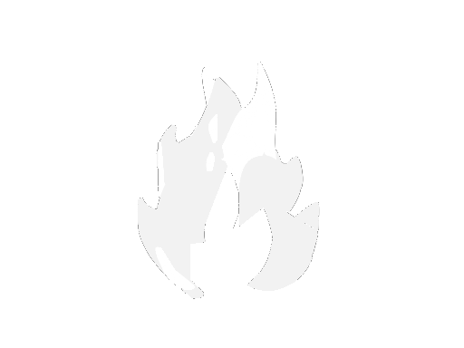
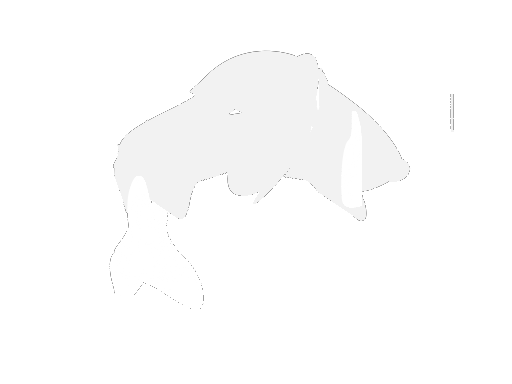
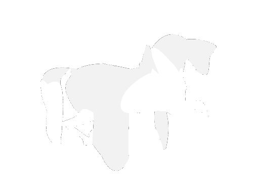
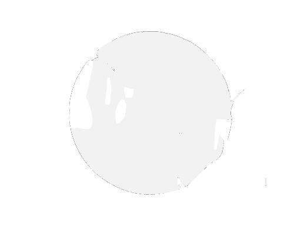
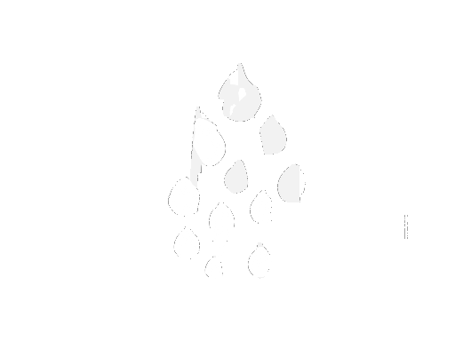
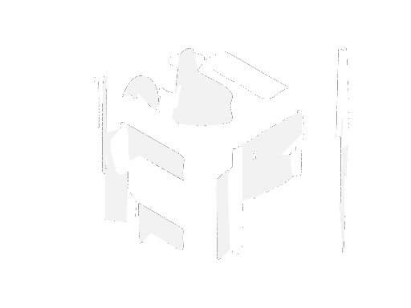

# Snapshot — original-weights batch `orig_20260724`

Taken **2026-07-25 03:45 EDT**. `water_fire` has **converged and exited clean**;
the other six are still running (4h–5h in).

Source: `aps-original`, branch `original-baseline`,
`results/original/orig_20260724`. Submitted by `submit_original.py`, which has
no `--collect` mode — the converged run's numbers below are read straight from
its `report.txt`, reproduced whole in `converged/`.

Weights are the SceneOptimizer class defaults, **silhouette 2.0 / negative
space 2.5, non-normalized**. Note the arm is `srd` with conflict-gated restart —
this batch is full SRD at original weights, not a no-SRD baseline.

## Converged: `orig_water_fire` (job 4280432, COMPLETED, 04:56:43 elapsed)

Stopped on plateau at step 2150, no IoU/loss gain for 300 steps.

| metric | value |
|---|---|
| final mean IoU | **0.968497** |
| best mean IoU | **0.973133** @ step 1650 |
| view1 / view2 IoU | 0.972190 / 0.964805 |
| final loss | 0.021490 (best 0.017221 @1850) |
| final mean spill | 0.009887 (best 0.005170) |
| view1 / view2 spill | 0.007381 / 0.012393 |
| mean precision | 0.989995 |
| mean coverage | 0.978064 |
| final overlap | 1.808e-05 |
| patches | 24 final (20 start, 20–29 range, mean 25.2) |
| SRD | 14 adds, 4 splits, 14 deletes, 2 restarts |
| runtime | 17486 s total, 309 s setup |

Time-to-IoU, from the report's convergence block:

| threshold | steps | seconds |
|---|---|---|
| 0.50 | 50 | 347 |
| 0.70 | 100 | 706 |
| 0.80 | 175 | 1125 |
| 0.85 | 225 | 1564 |
| 0.90 | 275 | 2049 |
| 90% of final | 250 | 2010 |
| 95% of final | 350 | 2893 |
| 99% of final | 725 | 5967 |

It reaches IoU 0.90 in 275 steps and 99% of its final quality by step 725, then
spends the remaining 1425 steps gaining under a point. Precision 0.990 against
coverage 0.978 — much more balanced than the negspace runs, which trade coverage
away to keep precision.

## Still running (last logged step, 03:45 EDT)

| pair | step | loss | mean IoU | spill | patches | overlap |
|---|---|---|---|---|---|---|
| cat_face_bass | 2200 | 0.0704 | 0.946 | 0.0246 | 25 | 5.6e-4 |
| sun_moon | 1800 | 0.0603 | 0.951 | 0.0236 | 30 | 2.1e-4 |
| horse_circle | 1000 | 0.1880 | 0.898 | 0.0638 | 29 | 1.4e-5 |
| dance_argument | 1200 | 0.1280 | 0.861 | 0.0383 | 26 | 1.9e-5 |
| teapot_droplets | 1300 | 0.0801 | 0.858 | 0.0721 | 34 | 8.7e-5 |
| acm_scf | 1200 | 0.2411 | 0.820 | 0.1294 | 29 | 1.1e-4 |

cat_face_bass is past the step where water_fire converged and is flat to three
decimals — expect it to trip the plateau stop next. acm_scf remains the outlier:
0.129 spill at step 1200, an order of magnitude above water_fire's converged
0.010, and its loss is still above 0.24.

## Against the negspace `nonorm4` batch

Now that one run on each side has converged, the first honest comparison:

| | negspace nonorm4 | original weights |
|---|---|---|
| converged at | step 1500 | step 2150 |
| final mean IoU | 0.936 | **0.968** |
| best mean IoU | 0.945 | **0.973** |
| final mean spill | **0.0060** | 0.0099 |
| precision | **0.994** | 0.990 |
| coverage | 0.942 | **0.978** |
| final patches | 22 | 24 |
| runtime | 12201 s | 17486 s |

Original weights win IoU by 3.2 points and coverage by 3.6, and take 650 more
steps and 87 more minutes to get there. Negspace wins spill (0.006 vs 0.010) and
precision. That is the tradeoff stated plainly on the one pair where both have
actually finished: **negative-space weighting buys cleaner edges and pays for it
in fill.** Whether that holds on the hard pairs is still open — acm_scf and
teapot_droplets have converged on neither side.

## Contents

- `converged/` — the complete record for `orig_water_fire`: `report.txt`,
  `history.csv` (full per-step trace), and both final exported views at
  `--render-scale 4`
- `latest/` — most recent frame pair for all 7 jobs,
  `orig_<pair>_step<NNNNN>_view<N>.png`. For water_fire this is the last frame
  written before it exited (step 2150); for the rest it is wherever they were at
  03:45.
- `collected/original_manifest.tsv` — job IDs, weights, output dirs

Intermediate frames stay on Oscar under
`results/original/orig_20260724/*/renders/`.

## Converged run, final export

| view 1 | view 2 |
|---|---|
|  |  |

## Whole batch, latest frame

| pair | view 1 | view 2 |
|---|---|---|
| water_fire **(converged)** |  |  |
| sun_moon |  |  |
| cat_face_bass |  |  |
| horse_circle |  |  |
| dance_argument |  |  |
| teapot_droplets |  |  |
| acm_scf |  |  |
